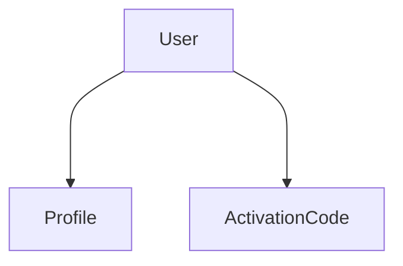

### About Project
In this project I used Django, DRF, Django Signals, Celery, Redis and django-simple-jwt to make a token based Authentication system with custom user models.
User can SignUp and LogIn to the application using both Email or Mobile fields interchangeably.
An Activation Code will send through the SMS (Using Celery) when user signs up or changes his/her mobile number in the system.
Users can not login untill they do verification at least for one of the options: email or mobile.
A profile object will make for each user on registration, using signals.
### Run Project Using Docker
`docker-compose up -d --build`

### API Documents
`locallhost:8000/`

### Models

- The Profile model and User model have a OneToOne relation.
- The ActivationCode model and User model have FK relation.
- all models are inherited from an abstract BaseModel with fields created_at and updated_at
- created_at for activation codes is used for control the expiration of code.